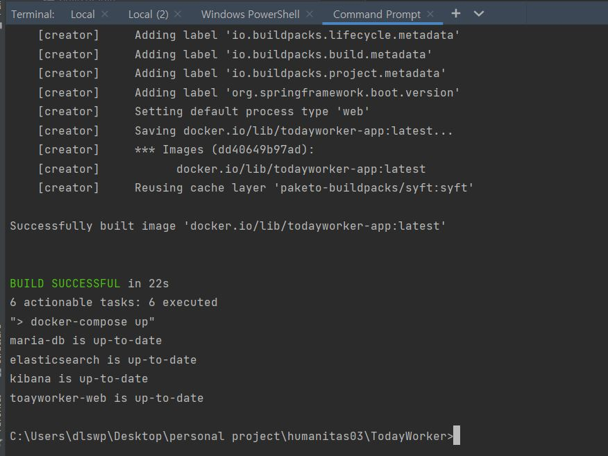
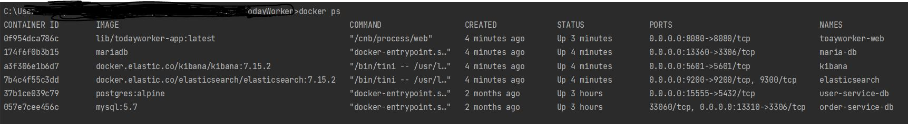
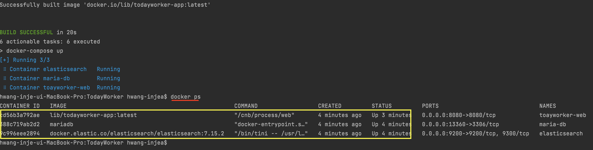
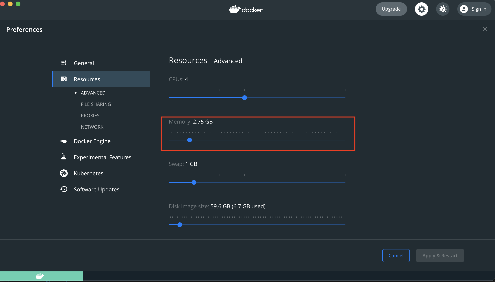

<h1><strong>프로젝트명 : Only(오늘도 직장인[오직])</strong></h1>


# 프로젝트 기간

2021/08/16 ~

# contributor

- 남규형 (https://github.com/skarbgud)
- 김진희 (https://github.com/wlsgml0229, https://github.com/peacelove27)

## FE 개발자를 위한 로컬에서 서버 환경 구성을 자동화

### 필수조건

**각자 OS 환경에 맞는 Docker 환경이 설치되어 있어야 합니다.**

### windows

```bash
> cd $projectDir
> local-server.bat
```



### MacOS / Linux

```bash
> cd $projectDir
> ./local-server.sh
```

### 정상 구성 확인

> **```docker ps```**

**Windows**



**MacOS**



* 메모리 이슈로 Container 구동이 제대로 되지 않는다면 docker-desktop 설정에서 memory 할당치를 늘려주세요
* 


## Swagger-UI

> http://localhost:8080/swagger-ui/index.html
